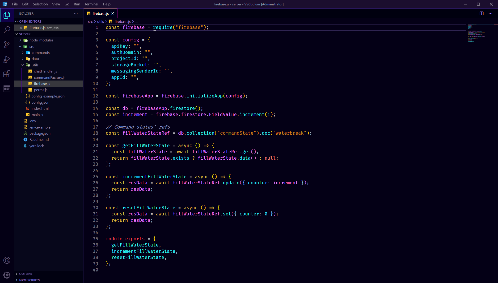

# Midnight Synth - VSCode Theme

My personal dark theme. A mix of some of my favorite themes: Tokyo Night, Synthwave '84, and Celestial. Best used in conjunction with the Bracket Pair Colorizer 2 extension.

# Installation

1.  Install [Visual Studio Code](https://code.visualstudio.com/)
2.  Launch Visual Studio Code
3.  Choose **Extensions** from menu
4.  Search for `midnight synth`
5.  Click **Install** to install it
6.  Click **Reload** to finish installing
7.  Then, from the menu: File > Preferences > Color Theme > **Midnight Synth**
